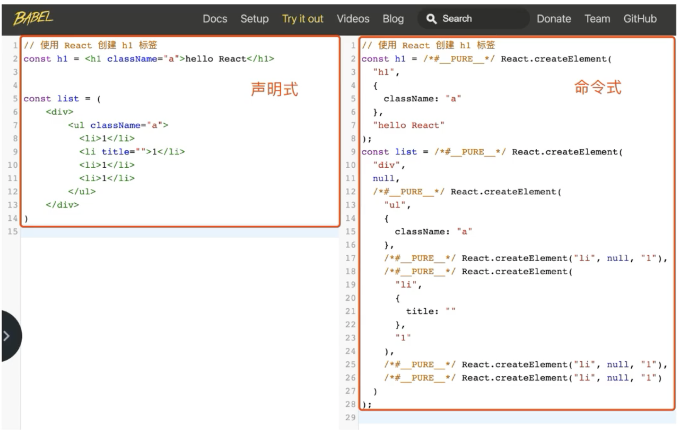

```
npx create-react-app react-basic


https://pnpm.io/zh/6.x/cli/dlx
pnpm dlx
从源中获取包而不将其安装为依赖项，热加载，并运行它公开的任何默认命令二进制文件。
pnpm dlx create-react-app react-basic2
```

du -sh
npm install tar@latest -g
npm install svgo@latest -g

npm start

pnpm install
pnpm start

pnpm add -g sax 安装软件包到全局环境中 Install package globally
pnpm add sax 保存到 dependencies 配置项下 Save to dependencies
pnpm add -D sax 保存到 devDependencies 配置项下 Save to devDependencies
pnpm add -O sax 保存到 optionalDependencies 配置项下 Save to optionalDependencies

https://www.bilibili.com/video/BV1Z44y1K7Fj?p=5&spm_id_from=pageDriver&vd_source=8d4b220c3958f634b9f3e09271aebf79

jsx 并不是标准的 JS 语法，是 JS 的语法扩展，浏览器并不认识，脚手架中内置的@babel/tranform-react-jsx 插件，用来解析 jsx 语法。



## code

https://gitee.com/react-cp/react-pc-code

https://gitee.com/react-course-series

##

JS 中出现() 表示其中想要写 html 比如组件的 return (<div></div>)
